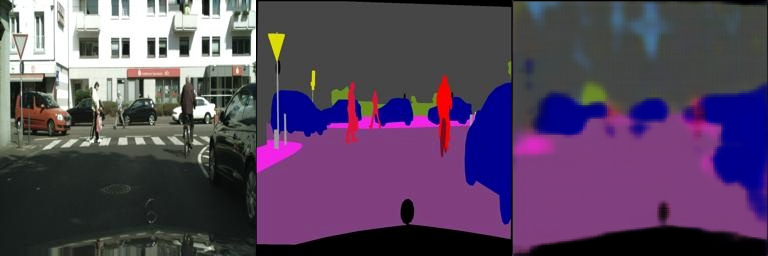

# 实验报告

## 1. 实验名称
实验名称：**[Poisson编辑与图像的语义分割]**

## 2.简单介绍
本次实验的主要目的是利用pytorch框架，一是学会如何使用torch里面的优化算法完成对图像的poisson编辑,而是利用torch搭建fully convolutional network完成对图像的语义分割。

## 3. 实验结果
总结实验得到的最终结果，突出实验的结论和发现。

- 结果一：
  
- 结果二：
  尝试了两种网络，一是普通的卷积神经网络，四层卷积四层反卷积，100轮训练val_error大概是0.12左右；二是实现了论文里给的架构，在二十轮训练左右便能降到0.098左右,从下面的结果中也可以看到，论文里的架构在训练过程中，loss下降的更快，segmentation的效果也更好。

  ### 普通卷积神经网络：
  
  
  
  
  

  ### 论文里给的架构:
  
  
  
  
  
