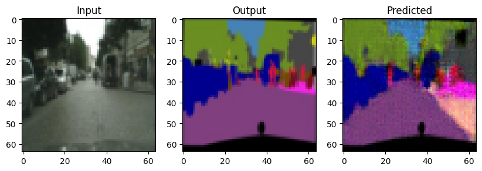
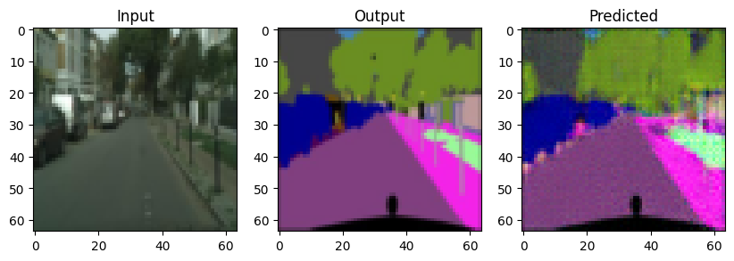
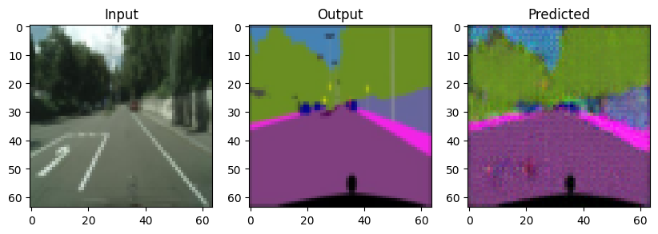

# Assignment 3 - Play with GANs

### In this assignment, you will implement two methods for using GANs in digital image processing.

### Resources:
- [DragGAN](https://vcai.mpi-inf.mpg.de/projects/DragGAN/): [Implementaion 1](https://github.com/XingangPan/DragGAN) & [Implementaion 2](https://github.com/OpenGVLab/DragGAN)
- [Facial Landmarks Detection](https://github.com/1adrianb/face-alignment)

---

\
See [作业03-Play_with_GANs.pptx](https://rec.ustc.edu.cn/share/705bfa50-6e53-11ef-b955-bb76c0fede49) for detailed requirements.

## Task 1: GAN for segmentation
    Increment hw2 with discrimitive loss
### 实验结果：训练一百轮的结果如下

## Task 2: DragGAN for image editing
    Combine DragGAN with automatic facial landmark detection
### 实验结果：实现了自动瘦脸，微笑和大眼功能
<!-- 插入结果gif动图 -->

